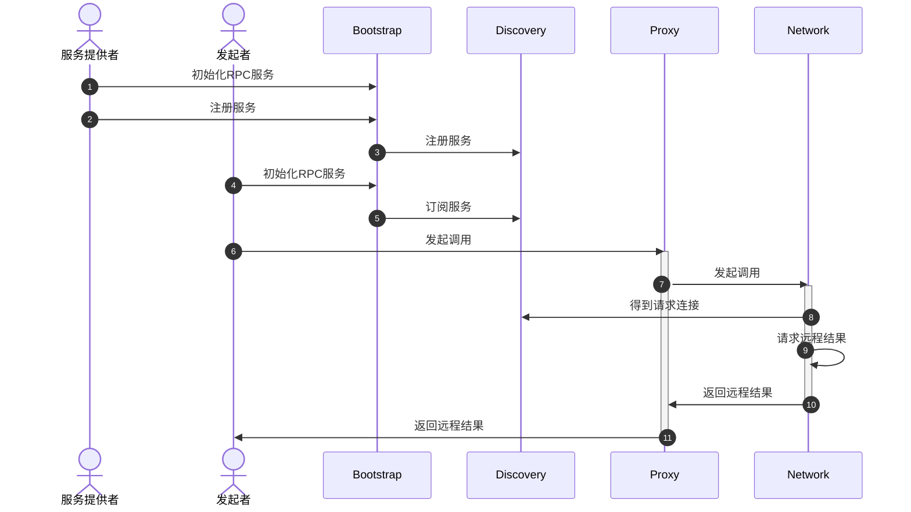

# 简介
HappyRPC 是利用 Netty、JDK动态代理 以及 Nacos服务注册中心 实现的一个简单易用高效的 RPC 框架，并引入了 Spring Boot 自动装配支持。
---
# 整体架构
## 架构图

各模块介绍：
- Bootstrap：用于统一初始化各个模块组件，为用户提供使用接口
- Discovery：服务发现组件，该组件包括两个部分，分别是注册中心和负载均衡器，注册中心负责向远程注册中心注册、监听与查询服务，负载均衡器负责在查询服务的基础上按照一定的策略选择一个服务提供者。这里采用 Nacos 作为远程注册中心，使用随机算法进行负载均衡。
- Network：基于 Netty 实现的网络组件，包括 Server 和 Client，其中 Server 负责接收并处理 RPC 请求，Client 负责发起 RPC 请求。
- ProxyFactory：该组件可利用 JDK Proxy 技术对 RPC 服务接口进行包装生成一个代理服务对象，该代理对象提供给用户进行 RPC 调用，对于用户来说屏蔽掉了底层实现。
- Storage：该组件保存了一系列框架内部通用的存储，分别为：Response Map（保存已发起但尚未返回的调用，键为运行时生成的唯一标识 ID UUID）、Channel Future Map（保存已经建立连接的 Channel Future 对象，键为远程地址）、Service List Map（保存当前已订阅服务的服务列表，键为服务名称）与 Service Map（保存实际的 Service Provider 对象，键为服务名称）。
- Serialization：该组件可以将 RPC 调用对象或者响应对象序列化为字节数组，方便进行网络传输，这里采用 FastJson2 作为序列化实现。
## 整体RPC流程图

## 重难点
1. RPC 请求与响应分开，减少传输字节。
2. 接口设计
3. 基于 Netty 实现心跳
4. RPC 请求返回忙等待改为阻塞等待，使用CountDownLatch，减轻 CPU 压力。
5. RPC 请求返回可包装异常，这里值得注意的是，原本发送线程和调用线程实际是两个线程，这里合为一个线程，使得用户线程可以捕获网络错误。
6. RPC 统一异常处理：
  1. 设置一个统一异常类：MyRpcException
  2. 下分三个异常类型：网络异常（包括注册中心连接异常），参数异常（包括注册中心参数异常）与目标异常
  3. NetworkException、ParameterException 和 TargetException
7. Spring Boot 自动装配集成：
  1. 实现类似于 Dubbo 的 Reference 注解，自动生成代理类。
  2. 通过 starter 的 spring.factories 文件指定配置类。
  3. 配置类，配置必要组件与一个 BeanPostProcessor 。
  4. MyrpcBeanPostProceesor 的 beforeInitializing 方法，通过查询组件内的字段寻找自动生成代理类的目标，这里参考了 Spring Boot 的 Autowired 注解的实现。
